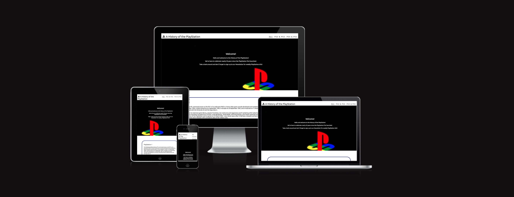
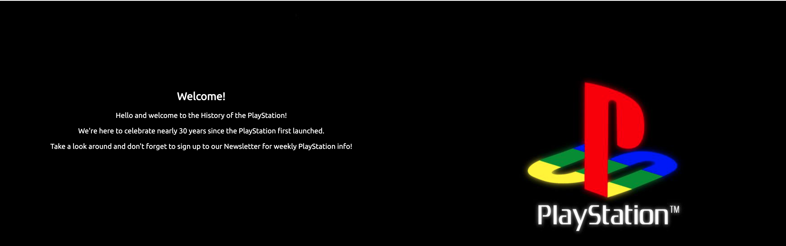
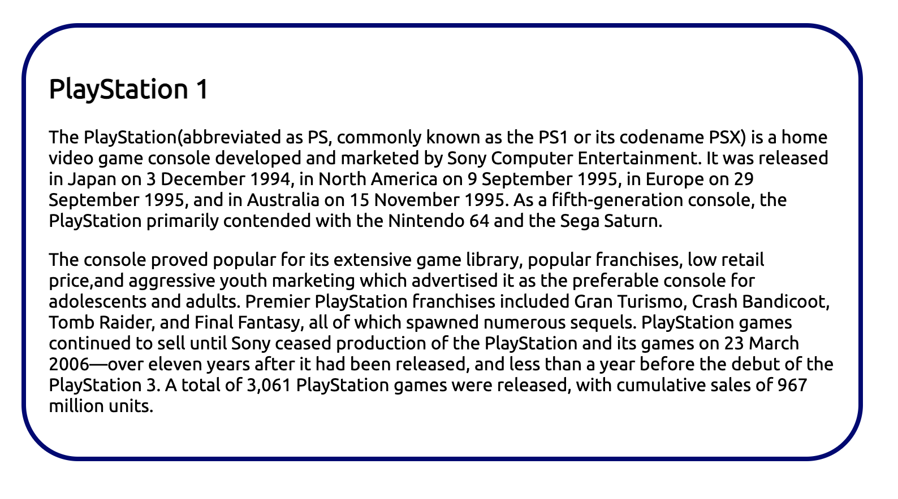
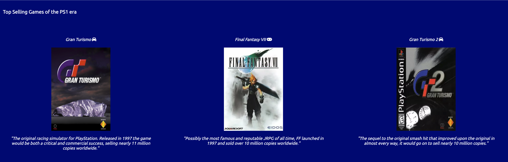
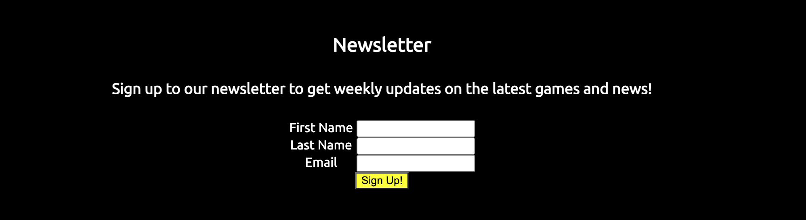

A History of the PlayStation

[View live project here](https://supersheep50.github.io/A-History-of-Playstation/)

This website is designed to be an informational resource for PlayStation fans and newcomers alike. The site will be aimed at gamers and other folks who would love to learn more about the history of the PlayStation console as it quickly approaches its 30th anniversary. The website will chronicle each variation of the console and how it has changed over the years, from the PlayStation right up to the PlayStation 5.

Each section will also include some examples of the best selling games for each generation.

- Desktop Screenshot - [View](assets/images/desktop-screenshot.png) 
- Tablet Screenshot - [View](assets/images/tablet-screenshot.png)
- Mobile Screenshot - [View](assets/images/mobile-screenshot.png) 

## User Experience (UX)

-   ### User stories

    -   #### First Time Visitor Goals

        1. As a first time visitor I want to understand what The History of PlayStation website is and whats it's purpose is.
        2. As a first time visitor I want to understand how to navigate the site to find information and sections about the PlayStation with ease.
        3. As a first time visitor I want to learn about the different variations of the PlayStation and info behind their release. I want to see photos of each console to help me better understand them and also some select games from each console. 

    -   #### Returning Visitor Goals

        1. As a returning visitor I want to find out more information about the different PlayStation consoles and games in more detail. 
        2. As a returning visitor I'd like to see new PlayStation consoles and Best Selling games added. 
        3. As a returning visitor I'd like to be able to read up on more information about the Best Selling games.

    -   #### Frequent User Goals
        1. As a frequent user I want to sign up to a newsletter that keeps me informed on a weekly or monthly basis about PlayStation and gaming news.
        

-   ### Design

    -   #### Colour Scheme
        - The idea behind the colour scheme was to include as many of the prime Playstation logo colours as possible. I found the navy contrasted well against the black of the header background and the PS logo itself. The main colours I used were black, navy, white, yellow and red. I wanted to create a website that was easy to read and navigate.

    -   #### Typography
        - Ubuntu and Sans-serif were chosen as I felt they had a videogame feel to them. Similar to the type of font you'd find in many modern videogames today. They felt close to the font used by PlayStation on many of their own websites. 

    -   #### Imagery
        -  The header that was chosen is an iconic image of the PS logo on a black backdrop. The logo instills a particular sense of nostalgia for me and hopefully visitors to the site. I have also added photos of each of the consoles and their normal (not slim) versions. This gives users a better idea of what the info text is talking about, especially if they are not familiar with the consoles. Images have also been added to each of the best selling games for each console. I've used the cover art for the games as they add a great deal of colour to the website. 

*   ### Wireframes

    -   Desktop Wireframe - [View](assets/wireframes/Wireframes-Desktop.pdf) 

    -   Tablet Wireframe - [View](assets/wireframes/Wireframes-Tabelt.pdf)

    -   Mobile Wireframe - [View](assets/wireframes/Wireframes-Phone.pdf)

## Features

-   Responsive on all device sizes:
    - Mobile: [PS1](assets/images/mobile-screenshot.png)| [PS2&PS3](assets/images/mobile-ps2-ps3-screenshot.png) | [PS4&PS5](assets/images/mobile-ps4-ps5-screenshot.png) 
    - Tablet: [PS1](assets/images/tablet-screenshot.png)| [PS2&PS3](assets/images/tablet-ps2-ps3-screenshot.png) | [PS4&PS5](assets/images/tablet-ps4-ps5-screenshot.png) 
    - Desktop:[PS1](assets/images/desktop-screenshot.png)| [PS2&PS3](assets/images/desktop-ps2-ps3-screenshot.png) | [PS4&PS5](assets/images/desktop-ps4-ps5-screenshot.png)

-   Interactive elements:
    - Logo: Clicking the logo in the top left of each page will bring you back to the homepage. 
    

    - Nav bar: At the top right of each page is the menu. Each link turns red when you hover over it to let you know its interactive. There is a black underline for each link to let the user know which page they are on.
    

    - Header image zoom: The main header image zooms on the home page when first clicking into the website. A welcome message informs the user what the website is about.
    

    - PlayStation info text and image: Each PlayStation section has a box displaying information about the particular console. Hovering over the text turns it from black to red, helping to make it easier to read. The PlayStation image also zooms forward to give the user a more dynamic view of it.
     

    - Top Selling Games section: Each PlayStation console has a section displaying 3 of the best selling games that released for that console. Hovering over the image will cause it to zoom and clicking the image will bring you to the Wikipedia page for that game.
    

    - Newsletter: At the bottom of each pages is a Newsletter sign up form. Here users can sign up to the weekly Newsletter to keep informed about PlayStation news.
    

    - Social Links: At the bottom of each page is a clickable logo for Instagram, Twitter and Facebook. Clicking any of these links will bring the user to the PlayStation home page for each corresponding social media website. Hovering over the logos causes them to change color to white, letting the user know they are interactive.
    

## Technologies Used

### Languages Used

-   [HTML5](https://en.wikipedia.org/wiki/HTML5)
-   [CSS3](https://en.wikipedia.org/wiki/Cascading_Style_Sheets)

### Frameworks, Libraries & Programs Used

1. [Google Fonts:](https://fonts.google.com/)
    - Google fonts were used to import the 'Ubuntu'font into the style.css file which is used on all pages throughout the project.
1. [Font Awesome:](https://fontawesome.com/)
    - Font Awesome was used on all pages throughout the website to add social media icons and logos for aesthetic and UX purposes.
1. [Git](https://git-scm.com/)
    - Git was used for version control by utilizing the Gitpod terminal to commit to Git and Push to GitHub.
1. [GitHub:](https://github.com/)
    - GitHub is used to store the projects code after being pushed from Git.
1. [Balsamiq:](https://balsamiq.com/)
    - Balsamiq was used to create the wireframes during the design process.

## Testing

The W3C Markup Validator and W3C CSS Validator Services were used to validate every page of the project to ensure there were no syntax errors in the project.

- [W3C Markup Validator](https://validator.w3.org/#validate_by_input) - Results: [PS1](assets/images/ps1-html-code-validated.png) | [PS2-PS3](assets/images/ps2-ps3-validated-code.png) | [PS4-PS5](assets/images/ps4-ps5-code-validated.png) | [CSS](assets/images/css-code-validated%20.png)

### Testing User Stories from User Experience (UX) Section

-   #### First Time Visitor Goals

    1. As a first time visitor I want to understand what The History of PlayStation website is and whats it's purpose is.
        1. On the home page I can see the logo and website name displayed in the top left.
        2. On the home page there is also a welcome message displayed in the centre of the screen.

    2. As a first time visitor I want to understand how to navigate the site to find information and sections about the PlayStation with ease.
        1. At the top right of the screen there is a menu that lets me easily navigate between the pages.
        2. Clicking the logo at the top left will bring me back to the home page.

    3. As a first time visitor I want to learn about the different variations of the PlayStation and info behind their release. I want to see photos of each console to help me better understand them and also some select games from each console. 
        1. On each page there are PlayStation consoles listed with information in a text box beside them. 
        2. Each text box also has a console image beside it.
        3. Below each console image and info box is a selection of the top 3 selling games for that console. 

-   #### Returning Visitor Goals

    1. As a returning visitor I want to find out more information about the different PlayStation consoles and games in more detail. 
        1. Each console has detailed information about their release and console type. 
        2. Clicking on any of the best selling game icons will bring you to a Wikipedia page with more information about the game. 
    
    2. As a returning visitor I'd like to see new PlayStation consoles and Best Selling games added. 
        1. Right now the website is fully up to date with the most current consoles and best selling games data.
    
    3. As a returning visitor I'd like to see new games consoles included as they are released.
        1. Each Best Selling Game has a wikipedia article linked for further reading.

-   #### Frequent User Goals

    1. As a frequent user I want to sign up to a newsletter that keeps me informed on a weekly or monthly basis about PlayStation and gaming news.
        1. Newsletter sign up form is at the bottom of each page.
 

### Further Testing 

- The website was manually tested on an Iphone 12 XL, Iphone 13, Ipad Air and Macbook Pro.
- The website was manually tested on Google Chrome and Safari.
- The website was viewed in Developer tools at all settings of responsiveness. 
- All links clicked and checked. 
- Sent links to partner to check on her device and check for bugs. 
- Used Lighthouse to conduct desktop and mobile tests for performance, accessibility, best practices and SEO. 
    1. Desktop: [PS1](assets/images/ps1-lighthouse-test.png) | [PS2-PS3](assets/images/ps2-ps3-lighthouse-test.png) | [PS4-PS5](assets/images/ps4-ps5-lighthouse-test.png)
    2. Mobile: [PS1](assets/images/ps1-lighthouse-mobile-test.png) | [PS2-PS3](assets/images/ps2-ps3-lighthouse-mobile-test.png) | [PS4-PS5](assets/images/ps4-ps5-lighthouse-mobile-test.png)
                    

### Known Bugs (Resolved)
- The WC3 Validator reported back several bugs that I resolved: 
    1. Articles lacking heading on each of the pages. 
    2. End div tag on line 128 had no closing bracket. 
    3. Unclosed Element form on line 114 for index.html. 
- PlayStation console images appeared stretched when testing on mobile. Width had been set to auto for the div the image was in and this was causing issues.
- Originally had used float to position images. This caused major issues when it came to responivesness. Decided to use flex and re-write code. 
- Images were of different sizes and the zoom effect was causing them to stretch off of the page. Resized images and used flex to position correctly.
- 

### Known Bugs (Not Resolved)

## Deployment

### GitHub Pages

The project was deployed to GitHub Pages using the following steps...

1. Log in to GitHub and locate the [GitHub Repository]
2. At the top of the Repository (not top of page), locate the "Settings" Button on the menu.
3. Click the the "Pages" link on the left-hand side of the screen.
4. Under "Source", click the dropdown called "None" and select "Main Branch".
5. The page will automatically refresh.
6. Scroll back down through the page to locate the now published site [link](https://supersheep50.github.io/A-History-of-Playstation/) in the "Pages" section.

## Credits

- Some code was adapted and modifed from the Code Institute Love Running Project I completed recently.
- Image for PlayStation 1 was retrieved from [here](https://commons.wikimedia.org/wiki/File:PSX-Console-wController.jpg)
- Introduction and best-selling videogame information found [here](https://en.wikipedia.org/wiki/PlayStation_(console))
- Image converting tool can be found [here](https://cloudconvert.com/avif-to-webp)
- Image for Gran Turismo 1 logo can be found [here](https://strategywiki.org/wiki/Gran_Turismo)
- Image for Final Fantasy 7 logo can be found [here](https://www.mobygames.com/game/final-fantasy-vii)
- Image for PlayStation 2 can be found [here] (https://www.cbr.com/playstation-2-bestselling-console/)
- Playstation 2 Information and best selling games information can be found [here] (https://en.wikipedia.org/wiki/PlayStation_2)
- Image for Tekken 5 can be found [here] (https://en.wikipedia.org/wiki/Tekken_5)
- W3 Schools for Flex info and Mentor 

### Code

-   

### Content
-  

### Media

-   

### Acknowledgements
